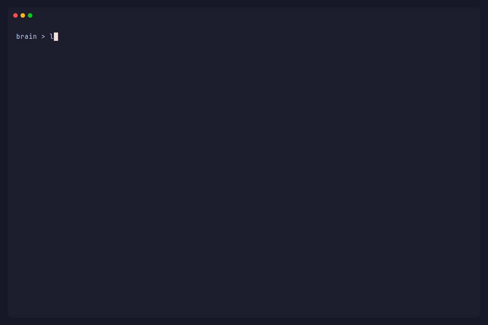

# brain

A portable, namespaced pack of agent skills — a structured loop, persistent memory, and a self-improving feedback cycle for any coding agent. Copy ten folders, add one line to `AGENTS.md`, get to work.



---

## Install

Each platform discovers skills from a `*/SKILL.md` layout and reads one always-on instructions file. They differ in where: opencode and Cursor use `.agents/skills/` + `AGENTS.md`; Claude Code uses `.claude/skills/` + `CLAUDE.md`. Pick yours below.

### Claude Code

Claude Code discovers skills from `.claude/skills/` (not `.agents/skills/`), so install there:

```bash
# clone this repo's brain-* folders into your project
git subtree add --prefix=.claude/skills https://github.com/omilli/ai-brain main --squash
```

Then add one line to your repo's `CLAUDE.md`:

```
Load the `brain-prime` skill before any substantive task.
```

That's it. Claude Code reads `CLAUDE.md` at the start of every session and discovers skills from `.claude/skills/` on demand. Claude Code reads `CLAUDE.md`, **not** `AGENTS.md` — if your repo already keeps instructions in `AGENTS.md`, import it from `CLAUDE.md` with a single line, `@AGENTS.md`, instead of duplicating.

---

### opencode

```bash
git subtree add --prefix=.agents/skills https://github.com/omilli/ai-brain main --squash
```

Add the same line to `AGENTS.md`:

```
Load the `brain-prime` skill before any substantive task.
```

opencode reads `AGENTS.md` and discovers skills from `.agents/skills/` (and `.opencode/skills/`) natively.

---

### Cursor

```bash
git subtree add --prefix=.agents/skills https://github.com/omilli/ai-brain main --squash
```

Cursor discovers skills from `.agents/skills/` automatically. To make `brain-prime` always-on, create one rule file:

`.cursor/rules/brain.mdc`

```
---
description: Load brain-prime before any substantive task
alwaysApply: true
---

Load the `brain-prime` skill before any substantive task.
```

---

> **Manual copy instead of subtree?**
> Copy the ten `brain-*/` folders directly into your skills directory — `.claude/skills/` for Claude Code, `.agents/skills/` for opencode and Cursor. `README.md` and `PACK.md` are inert — they are not `SKILL.md` files and are never discovered. A git submodule is **not** suitable: it nests one level too deep and hides the skills from discovery.

---

## Skills

| Skill | Role |
|---|---|
| `brain-prime` | The operating backbone — ethos, the loop, methodology, the non-negotiables. **Loaded first**, on every substantive task. |
| `brain-idea` | Stress-test an idea/plan before building; resolve load-bearing forks. Entry point. |
| `brain-audit` | Review/grade files against the repo's own rules; grounded findings. Entry point. |
| `brain-feature` | Surface grounded enhancement ideas, hand each to `brain-plan` as an evidence map. Entry point. |
| `brain-plan` | Turn a goal or evidence map into a task-contract (files, delta, scenarios, DoD). |
| `brain-worker` | Execute a plan task-by-task; tick each DoD only with cited evidence. |
| `brain-feedback` | After a run with friction, conservatively propose config/skill edits. |
| `brain-memory` | Persist verified decisions/facts to the repo's knowledge base; refresh/supersede. |
| `brain-skill` | Author new skills or revise existing ones. Standalone. |
| `brain-author` | Author/revise `AGENTS.md`, agent prompts, rules files. Standalone. |

---

## How it works

**The loop:**

```
brain-idea / brain-audit / brain-feature  (decide WHAT)
    → brain-plan      (structure HOW: a task-contract)
    → brain-worker    (execute, ticking each Definition of Done with evidence)
        on a plan-gap → back to brain-plan
        on a design fork → back to brain-idea
    → brain-feedback  (if the run hit friction, propose config/skill edits)
    → brain-memory    (curate durable decisions/facts into the repo knowledge base)
```

At startup, the agent loads only the `name` and `description` of each skill. When a task matches a skill's description, it reads the full `SKILL.md` into context. Context stays small; methodology arrives exactly when needed.

`brain-prime` carries four things every other skill assumes present:

- **Ethos** — ship the smallest correct change that fixes the root cause
- **Non-negotiables** — Done = solved + verified; every change carries its full blast radius; rules are inviolable
- **Methodology** — plan before editing anything non-trivial; find all call sites before changing a shared symbol; trace every claim to source read this session
- **Memory** — a markdown knowledge base at `<repo>/memory/` records verified decisions so prior learning is recallable, not re-derived. It is versioned in-repo and shared across agents/machines — distinct from Claude Code's machine-local native auto-memory (`~/.claude/projects/<project>/memory/`); the two coexist

---

## Authoring and extending

Every skill is repo-agnostic: no absolute paths, no `~/.config` references, no operator-specific assumptions. To extend, edit a `brain-*/SKILL.md` and keep the genericize rule: anything you add must hold in any repo. `brain-skill` and `brain-author` enforce anatomy, progressive disclosure, and cross-reference sync.

`PACK.md` lists the managed `brain-*` folders — the contract for clean updates (replace only those) and removal.

---

## Why the `brain-` prefix

Flat skill discovery (`skills/<name>/SKILL.md`) means names must be unique within a consumer's skills folder. The bare verbs (`plan`, `worker`, `memory`, `audit`, …) are generic and would silently overwrite a consumer's own skill of the same name on copy — and this pack is pure content with no tooling to guard that. The `brain-` prefix makes collisions impossible and doubles as the isolation marker: every `brain-*` skill is visibly part of this pack.
